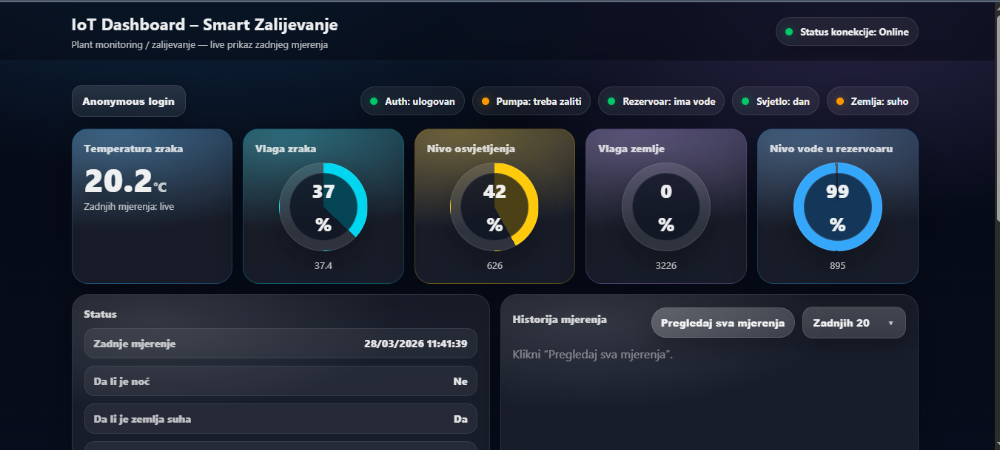
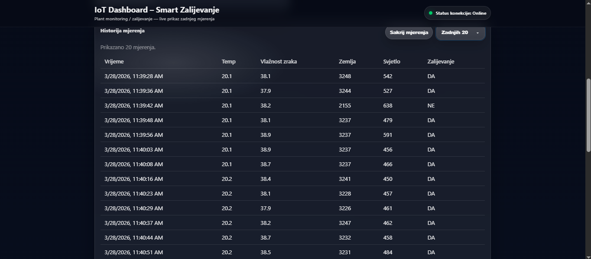
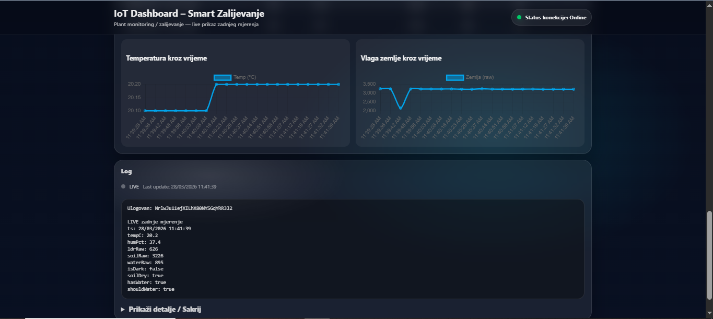
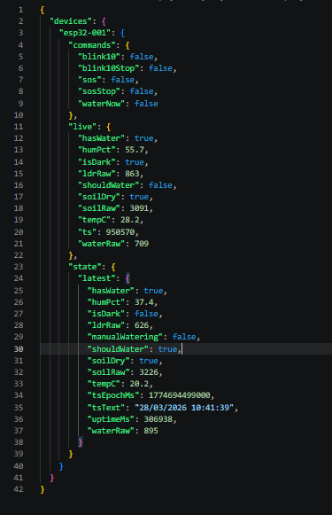
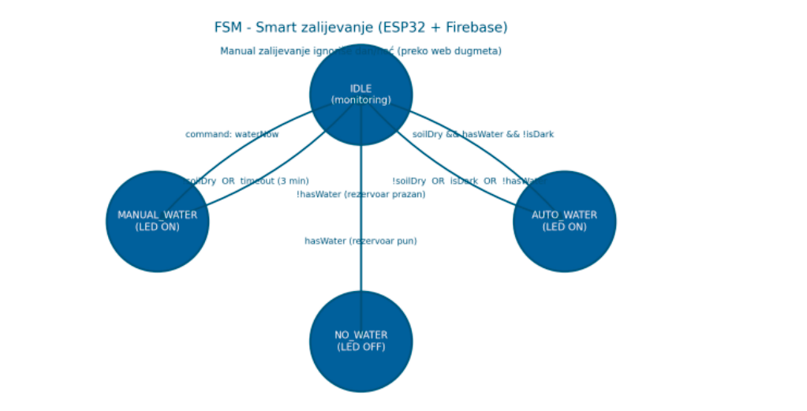

# IoT Smart Irrigation System

IoT Smart Irrigation System is an ESP32-based smart plant irrigation project that monitors environmental conditions and automates watering based on sensor data.

The system uses multiple sensors to track soil moisture, temperature, humidity, light level, and water level. It also includes a web dashboard connected to Firebase for real-time monitoring, manual watering commands, and sensor history visualization.

## Features

- ESP32-based smart irrigation system
- Soil moisture monitoring
- Temperature and humidity monitoring using DHT sensor
- Light level monitoring using LDR sensor
- Water level monitoring
- Automatic watering logic
- Manual watering control from the dashboard
- Firebase Realtime Database integration
- Firestore readings history
- Web dashboard for live monitoring
- Sensor charts and status overview
- LED signal commands
- NTP time synchronization

## Tech Stack

### Hardware

- ESP32 development board
- Soil moisture sensor
- DHT temperature and humidity sensor
- LDR light sensor
- Water level sensor
- Relay module
- Water pump
- LEDs
- Jumper wires
- Breadboard

### Firmware

- C++
- PlatformIO
- Arduino framework for ESP32
- WiFi connection
- Firebase client integration

### Dashboard

- HTML
- CSS
- JavaScript
- Firebase Realtime Database
- Firebase Firestore
- Firebase Hosting
- Firebase Cloud Functions

## Project Structure

```text
iot-smart-irrigation/
├── src/                  ESP32 firmware source code
├── include/              Configuration and header files
├── lib/                  Custom libraries
├── test/                 PlatformIO test files
├── iot-dashboard/        Web dashboard and Firebase functions
├── docs/                 Project documentation
├── assets/               Project preview images
├── platformio.ini        PlatformIO project configuration
└── README.md             Main project documentation
```

## How It Works

```text
1. ESP32 reads data from the connected sensors.

2. The firmware processes sensor values such as:
   - soil moisture
   - temperature
   - humidity
   - light level
   - water level

3. If the soil moisture level is too low, the system can activate watering.

4. Sensor data is sent from the ESP32 to Firebase Realtime Database.

5. The web dashboard reads live data from Firebase and displays:
   - current sensor values
   - irrigation status
   - water level status
   - charts and history

6. Firebase Cloud Functions can mirror the latest sensor readings into Firestore.

7. The user can use the dashboard to send manual commands such as:
   - start watering
   - trigger LED signal
   - activate blink command

8. ESP32 receives the command from Firebase and performs the requested action.
```

## Firebase Data Flow

```text
ESP32
  ↓
Firebase Realtime Database
  ↓
Web Dashboard

Realtime Database
  ↓
Firebase Cloud Function
  ↓
Firestore Readings History
```

## Dashboard Flow

```text
User opens dashboard
        ↓
Dashboard connects to Firebase
        ↓
Live sensor data is displayed
        ↓
User can send manual command
        ↓
Command is stored in Firebase
        ↓
ESP32 reads command
        ↓
ESP32 activates pump or LED signal
```

## Configuration

Sensitive configuration values such as WiFi credentials and Firebase keys should not be committed to GitHub.

Use the example configuration file:

```text
include/config.example.h
```

Create your own local configuration file:

```text
include/config.h
```

The local `config.h` file should contain real WiFi and Firebase values and should be ignored by Git.

Example configuration:

```cpp
#define WIFI_SSID "your-wifi-name"
#define WIFI_PASSWORD "your-wifi-password"

#define FIREBASE_API_KEY "your-firebase-api-key"
#define FIREBASE_DATABASE_URL "https://your-project-default-rtdb.firebaseio.com"
#define FIREBASE_PROJECT_ID "your-project-id"

#define DEVICE_ID "esp32-001"

#define PIN_DHT 4
#define PIN_LDR 32
#define PIN_SOIL 34
#define PIN_WATER 35
#define PIN_WATER_LED 22
#define PIN_SIGNAL_LED 23
```

## How to Run

### ESP32 Firmware

```text
1. Install Visual Studio Code.
2. Install the PlatformIO extension.
3. Open the project folder in VS Code.
4. Create include/config.h based on include/config.example.h.
5. Connect the ESP32 board via USB.
6. Build and upload the firmware.
```

Build and upload firmware:

```bash
pio run --target upload
```

Open serial monitor:

```bash
pio device monitor
```

### Web Dashboard

Go into the dashboard folder:

```bash
cd iot-dashboard
```

If the dashboard uses Firebase Hosting, deploy it with:

```bash
firebase deploy
```

If Firebase Functions are used, install dependencies first:

```bash
cd iot-dashboard/functions
npm install
```

Then deploy functions:

```bash
firebase deploy --only functions
```

## Documentation

```text
docs/hardware.md              Hardware components used in the project
docs/wiring.md                Wiring and ESP32 pin connections
docs/architecture.md          System architecture and data flow
docs/firebase-structure.md    Firebase database structure
docs/future-improvements.md   Planned improvements
```

## Screenshots

### Dashboard Home



### Dashboard History



### Charts and Logs



### Firebase Realtime Database Structure



### FSM Diagram



## Hardware Note

The physical prototype was assembled and tested during development, but it was later disassembled before taking a final hardware photo.

Because of that, this repository focuses on dashboard screenshots, Firebase data structure, FSM logic diagram, and written hardware/wiring documentation.
## Future Improvements

```text
- Add mobile responsive dashboard design
- Add advanced irrigation history charts
- Add support for multiple plants or irrigation zones
- Add notification system for low water level
- Add automatic watering schedule
- Add authentication for dashboard access
- Improve sensor calibration
- Add enclosure or case design for hardware setup
```

## Project Status

```text
This project is currently in development.

It was built as an IoT prototype for smart plant monitoring, automated irrigation, Firebase-based real-time communication, and dashboard visualization.
```

## Author

```text
Amina Ahmić
```